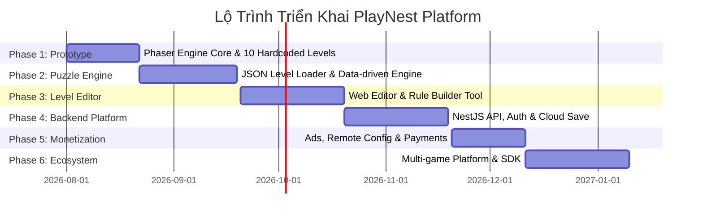

# Kế Hoạch Phát Triển & Kiến Trúc Hệ Thống PlayNest Web Game Platform

> **Tài liệu tham chiếu:** *Kiến trúc hệ thống PlayNest Web Game Platform*  
> **Phiên bản:** 1.0  
> **Ngày tạo:** 28/07/2026  
> **Trạng thái:** Đã phê duyệt kiến trúc tổng quan - Chuẩn bị triển khai MVP

---

## 1. Tổng Quan Dự Án (Project Overview)

**PlayNest** là nền tảng **Web Game Casual**, cho phép người dùng mở trình duyệt (Mobile, Tablet, Desktop) và chơi ngay mà không cần cài đặt ứng dụng. 

### 1.1 Mục tiêu hệ thống
* **Gameplay ngắn gọn:** Màn chơi giải đố (Brain Test) kéo dài 5–30 giây/màn.
* **Tương tác đa dạng:** Hỗ trợ chạm (tap), kéo (drag), thả (drop), giữ (hold), xoay (rotate), phóng to (pinch) và đa điểm (multi-touch).
* **Data-driven Content:** Nội dung màn chơi quản lý hoàn toàn bằng dữ liệu JSON.
* **Level Editor:** Công cụ trực quan cho Game Designer tự sản xuất màn chơi mà không cần can thiệp code.
* **Khả năng mở rộng:** Dùng chung hạ tầng cho hàng chục game casual khác nhau.
* **Offline-First:** Tải trước tài nguyên và chơi offline thông qua PWA (Progressive Web App).
* **Monetization:** Tích hợp quảng cáo (Banner, Interstitial, Rewarded Ads), gói bỏ quảng cáo và vật phẩm hỗ trợ.

---

## 2. Kiến Trúc Tổng Quan & Công Nghệ (Tech Stack)

### 2.1 Sơ đồ kiến trúc tổng quan (High-Level Architecture)

```
┌────────────────────────────────────────────────────────────┐
│                    Người Chơi (Client)                     │
│    Mobile Browser    │    Desktop Browser    │    PWA     │
└──────────────────────────────┬─────────────────────────────┘
                               │
                               ▼
┌────────────────────────────────────────────────────────────┐
│               PlayNest Web Application                     │
│    React / Next.js Framework                               │
│    ├── Landing Page & Game Library                         │
│    ├── User Profile & Achievements                         │
│    └── Game Container (Wrapper)                            │
└──────────────────────────────┬─────────────────────────────┘
                               │
                               ▼
┌────────────────────────────────────────────────────────────┐
│                Phaser 3 Game Runtime                       │
│    ├── Scene Manager       ├── Puzzle Engine               │
│    ├── Interaction Engine  ├── Level Loader                │
│    └── Save Manager        └── Audio & Animation Engine    │
└──────────────┬──────────────────────────────┬──────────────┘
               │                              │
               ▼                              ▼
┌──────────────────────────────┐┌────────────────────────────┐
│    Local Game Storage        ││        Backend API         │
│  - IndexedDB (Level & Save)  ││  - Authentication (Auth)   │
│  - Service Worker Cache      ││  - Cloud Save & Sync       │
│  - Local Settings            ││  - Remote Config & Analytics│
└──────────────────────────────┘└──────────────┬─────────────┘
                                               │
                                               ▼
                                ┌────────────────────────────┐
                                │         Data Layer         │
                                │  - PostgreSQL              │
                                │  - Redis Cache             │
                                │  - Object Storage / CDN    │
                                └────────────────────────────┘
```

### 2.2 Công nghệ lựa chọn (Technology Stack)

| Phân vùng | Công nghệ lựa chọn | Lý do sử dụng |
| :--- | :--- | :--- |
| **Frontend Web** | Next.js / React, TypeScript, Tailwind CSS | Quản lý trang web, SEO, routing, trạng thái ứng dụng (Zustand), UI mượt mà. |
| **Game Engine** | Phaser 3 (WebGL / Canvas) | Nhẹ, dung lượng bundle nhỏ, tối ưu mobile browser vượt trội so với Unity WebGL. |
| **Backend API** | NestJS (TypeScript) | Đồng nhất ngôn ngữ TypeScript từ client tới server, phát triển nhanh, dễ chia sẻ model/validation. |
| **Database** | PostgreSQL, Redis | PostgreSQL quản lý dữ liệu người dùng, tiến trình; Redis cache session & leaderboard. |
| **Storage & CDN** | Cloudflare R2 / AWS S3 + CDN | Phân phối WebP/AVIF images, audio (MP3/OGG) và Level JSON tốc độ cao. |
| **Monorepo Tool** | pnpm workspace + Turborepo | Tối ưu hóa việc dùng chung SDK, UI components và Types giữa các sub-apps. |

---

## 3. Cấu Trúc Monorepo Đề Xuất (Monorepo Directory Structure)

```text
playnest/
├── apps/
│   ├── web/                    # App Next.js chính (Landing, Library, Profile, Game Container)
│   ├── api/                    # NestJS Backend API Gateway & Modules
│   ├── level-editor/           # Web Tool kéo thả cho Designer tạo Level
│   └── admin/                  # Dashboard quản trị (Users, Games, Remote Config, Ads)
│
├── packages/
│   ├── game-engine/            # Phaser wrapper & base scene managers
│   ├── puzzle-engine/          # Core puzzle evaluator, condition checker & rule engine
│   ├── level-schema/           # Zod / JSON Schema validation cho Level Spec
│   ├── analytics-sdk/          # Event tracking SDK
│   ├── ads-sdk/                # Unified Ads integration (AdSense, Rewarded Ads)
│   ├── auth-sdk/               # Client-side Auth helper
│   ├── ui/                     # UI components dùng chung (React/Tailwind)
│   └── shared-types/           # TypeScript interfaces & DTOs
│
├── games/
│   ├── tricky-brain/           # Game Puzzle 1 (Brain Test style)
│   ├── word-puzzle/            # Game 2 (mở rộng tương lai)
│   └── hidden-object/          # Game 3 (mở rộng tương lai)
│
├── infrastructure/
│   ├── docker/                 # Dockerfile & Docker Compose
│   ├── terraform/              # Infrastructure as Code
│   └── ci-cd/                  # GitHub Actions workflow pipelines
│
└── docs/
    ├── architecture/           # Tài liệu kiến trúc chi tiết
    └── level-format/           # Quy chuẩn cấu trúc JSON level
```

---

## 4. Thiết Kế Game Engine & Cấu Trúc Dữ Liệu Level JSON

### 4.1 Luồng chuyển Scene trong Game (Phaser Scene Flow)
1. **BootScene:** Khởi tạo game, kiểm tra thiết bị, đọc cấu hình local, init analytics.
2. **PreloadScene:** Tải asset bắt buộc (UI, Font, Audio), tải Level đầu tiên, hiển thị loading progress bar.
3. **GameplayScene:** Parse JSON Level, render sprites, lắng nghe thao tác tương tác, đánh giá quy tắc (Rule Engine) và hiển thị kết quả chiến thắng/thất bại.

### 4.2 Hệ thống tọa độ chuẩn hóa (Responsive Math)
* **Base Design Canvas:** 1080 × 1920 (Tỉ lệ chuẩn 9:16).
* Tọa độ trong JSON được chuẩn hóa từ `0.0` đến `1.0`:
  * `x: 0.5`, `y: 0.5` ➔ Nằm chính giữa màn hình bất kể độ phân giải thiết bị.

### 4.3 Mẫu Cấu Trúc Dữ Liệu Level (`level-001.json`)

```json
{
  "id": "tricky-brain-001",
  "gameId": "tricky-brain",
  "version": 1,
  "questionKey": "level.tricky_brain_001.question",
  "background": {
    "type": "color",
    "value": "#FFF5D6"
  },
  "objects": [
    {
      "id": "cat",
      "type": "sprite",
      "asset": "cat_hungry",
      "position": { "x": 0.2, "y": 0.65 },
      "interactive": false
    },
    {
      "id": "fish",
      "type": "sprite",
      "asset": "fish",
      "position": { "x": 0.8, "y": 0.65 },
      "interactive": true,
      "interactions": [
        { "type": "drag" }
      ]
    }
  ],
  "variables": {
    "fishDelivered": false
  },
  "rules": [
    {
      "event": "drop",
      "source": "fish",
      "condition": {
        "type": "overlap",
        "target": "cat"
      },
      "actions": [
        { "type": "setVariable", "key": "fishDelivered", "value": true },
        { "type": "playAnimation", "target": "cat", "animation": "eat" },
        { "type": "completeLevel" }
      ]
    }
  ],
  "hintKey": "level.tricky_brain_001.hint"
}
```

---

## 5. Web Level Editor & AI Content Pipeline

### 5.1 Giao diện đề xuất của Level Editor (`apps/level-editor`)
* **Asset Panel (Trái):** Danh sách sprite, audio, shape, text có sẵn để kéo vào canvas.
* **Game Canvas (Giữa):** Hiển thị màn hình 9:16 trực quan, hỗ trợ kéo thả, resize, rotate object.
* **Properties Panel (Phải):** Chỉnh sửa thuộc tính object (Tọa độ, scale, góc xoay, z-index, animation).
* **Rule Builder (Dưới):** Xây dựng câu lệnh điều kiện trực quan (VD: `WHEN fish is dropped IF fish overlaps cat THEN play cat_eat animation & complete level`).

### 5.2 Quy trình sản xuất Level bằng AI (AI Content Pipeline)
```
Prompt Template ──► AI Level Idea Generator ──► Structured Level Spec
                                                        │
                                                        ▼
Designer Review ◄── Automated Validation (Schema/Zod) ◄─┘
       │
       ▼
QA Testing ──► Publish Level CDN
```

---

## 6. Offline-First, Lưu Tiến Trình & Bảo Mật

### 6.1 Chiến lược Offline-First (PWA)
* **Lần mở đầu tiên:** Service Worker tải App Shell, Engine và pack 20 level đầu tiên ➔ Lưu vào Cache Storage & IndexedDB.
* **Lần mở sau:** Khởi động tức thì từ Cache Storage/IndexedDB mà không phụ thuộc vào kết nối mạng.
* **Khi có mạng:** Tự động đồng bộ tiến trình (Background Sync), tải thêm Level Packs mới và gửi log Analytics.

### 6.2 Đồng bộ dữ liệu (Cloud Save Sync)
* Tiến trình được lưu ở `IndexedDB` trước. Khi người dùng đăng nhập tài khoản chính (Google/Apple), hệ thống thực hiện hợp nhất dữ liệu (Conflict Resolver):
  * Giữ level hoàn thành cao nhất.
  * Hợp nhất số hint balance và achievement.

---

## 7. Lộ Trình Triển Khai (Development Roadmap)



### Chi tiết các giai đoạn:
* **Phase 1 - Game Prototype (2–4 tuần):** Xây dựng Phaser Core, làm thử 10 level cứng, chạy mượt trên Mobile Web.
* **Phase 2 - Puzzle Engine:** Tách logic game ra data-driven (JSON level loader, rule engine, condition evaluator, 50 levels).
* **Phase 3 - Level Editor:** Hoàn thiện công cụ Web Editor cho Designer tự tạo màn chơi.
* **Phase 4 - Backend Platform:** Triển khai NestJS API, Anonymous Auth, Cloud Save, Admin Dashboard.
* **Phase 5 - Monetization:** Tích hợp SDK Quảng cáo, Remote Config, In-App Purchase (Stripe/Paddle).
* **Phase 6 - Multi-game Platform:** Đóng gói PlayNest SDK, phát triển thêm các thể loại game mới (Word Game, Hidden Object).

---

## 8. Phạm Vi Chi Tiết Cho Phiên Bản MVP (Phase 1 & Phase 2)

### 8.1 Mục tiêu MVP
Nhanh chóng đưa sản phẩm ra kiểm chứng gameplay (Proof of Concept) với chi phí hạ tầng tối thiểu.

### 8.2 Phạm vi tích hợp (MVP Scope)
* **1 Game:** `tricky-brain` (50 màn chơi giải đố).
* **1 Web Application:** React / Next.js wrapper + PWA offline support.
* **1 Puzzle Engine:** Parser JSON level, tương tác cơ bản (tap, drag, drop, overlap check).
* **Local Save:** Lưu tiến trình và số hint tại IndexedDB.
* **Analytics Layer cơ bản:** Gửi event `level_started`, `level_completed`, `level_failed`.

### 8.3 Thành phần chưa triển khai ở MVP
❌ Chưa cần Backend / Cloud Sync.  
❌ Chưa cần Đăng nhập tài khoản.  
❌ Chưa cần Quảng cáo / Thanh toán tiền thật.  
❌ Chưa cần Level Editor quá phức tạp (Level tạo trực tiếp bằng tay qua JSON file).  

---

## 9. Tiêu Chí Nghiệm Thu (Acceptance Criteria)

1. **Hiệu năng & Tải trang:**
   * Dung lượng tải ban đầu < 3MB.
   * FPS duy trì ổn định ≥ 55 FPS trên các thiết bị mobile phổ thông.
2. **Khả năng hiển thị (Responsiveness):**
   * Hiển thị chuẩn khung hình 9:16 trên iPhone, Android, Tablet và Desktop.
3. **Độ tin cậy của Puzzle Engine:**
   * Tải và parse đúng 100% file Level JSON theo schema.
   * Xử lý đúng các sự kiện tương tác (`drag`, `drop`, `overlap`, `setVariable`).
4. **Trải nghiệm Offline:**
   * Ngắt mạng sau lần tải đầu tiên, người dùng vẫn có thể chơi liên tục các màn chơi tiếp theo.
